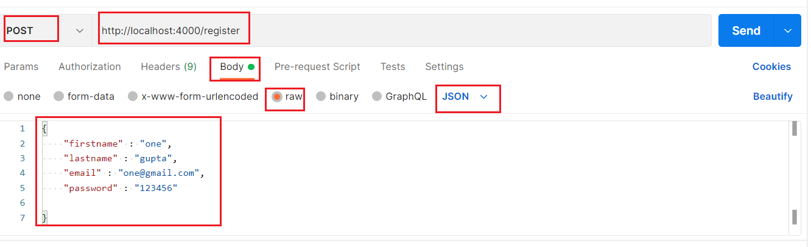
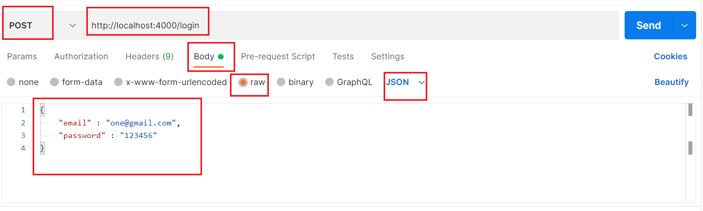

# JWT ( Json Web Token )
A project that helps to know about 'Json Web Token'.

### What is JWT ?
JSON Web Token (JWT) is an open standard ([RFC 7519]) that defines a compact and self-contained way for securely transmitting information between parties as a JSON object. This information can be verified and trusted because it is digitally signed. 
JWTs can be signed using a secret (with the **HMAC** algorithm) or a public/private key pair using **RSA** or **ECDSA**.

#### When should you use JSON Web Tokens?
 - Authorization
 - Information Exchange

#### What is the JSON Web Token structure?

In its compact form, JSON Web Tokens consist of three parts separated by dots (`.`), which are:

-   Header
-   Payload
-   Signature

Therefore, a JWT typically looks like the following.

`xxxxx.yyyyy.zzzzz`


[JWT In-Depth Knowledge](https://jwt.io/introduction)

[JWT Playground](https://jwt.io/#debugger-io)


## To Run the application :
You should have installed ***[nodeJS](https://nodejs.org/en/download/)*** and **[postman](https://www.postman.com/downloads/)** and [**MongoDB**](https://www.mongodb.com/try/download/community) in your machine.
We will be using postman to test our application. You can use any front-end for the same.
Also make sure mongoDb is installed correctly.

 - Clone the project
 
	 `git clone [project-link]`
	 
 - Install NPM dependencies 
 
 `npm install`
 
 - Run the server 
 
`npm run start`

- Register a User first. 

`http://localhost:4000/register`

to register a user. Format will be as follows : 



Congratulations !!! User is successfully saved in database.

- Login with existing user to check jwt working 

`http://localhost:4000/login`

to login user. Format will be as follows : 



Congratulations !!! User is successfully logged into application.


You can now access the **SECRET ROUTE** `http://localhost:4000/dashboard`

Since we have done with using the application, Now let's understand how **JWT** is working in background. 🙌🙌🙌

## Working of JWT in this application

We are using a popular jwt library for encoding and decoding of token. For more info visit [JWT NPMJS](https://www.npmjs.com/package/jsonwebtoken)
And to encrypt the password we are using [bCryptJS](https://www.npmjs.com/package/bcryptjs)

We will be using jwt in this flow :

 1. First user is registered into database
 2. User is going to login, and that's where a **new** token is generated specific for this user
 3. This genrated token is saved into cookies, so that accessing the SECRET route, this jwt token is checked for the confirmation.


### When User is going to login 
We are going to find the user from database and validate password using bCryptJS, and is everything is okay, then we are going to generate a new token using the jsonwebtoken library.

It has 3 parameters : 

 1. what data you want to encode in this token, here i want to encode an object having 2 key i.e user_id and email.
 2. A secret key which can be any random string
 3. Time when this token is going to expires, in this case i have allocated 2 hour lifespan of this token.

``` javascript    
const  token = jwt.sign(
    {
	    user_id:  user._id, email
    },
	process.env.SECRET_KEY,
    {
	    expiresIn:  "2h"
    }
);
```

and then pass/save this token into cookies to front-end. We are using [cookie-parser](https://www.npmjs.com/package/cookie-parser) npm library to do this work.

```javascript
const  options = {
	expires:  new  Date(Date.now() + 3 * 24 * 60 * 60 * 1000),
	httpOnly:  true
}

res.status(200).cookie('token', token, options).json({
	success:  true,
	token,
	user
});
```

#### Okay so now user is logged in, but how should validate that the token which is generated is authorized user and he/she is requesting to access the SECRET route is allowed ?

### Validating JWT token

When logged in user tries to access the SECRET route i.e in our case `/dashboard` then, a middleware ***auth*** is going to validate the token.

For that backend has to fetch the token which is set in cookies when user was login.

***Note*** For those who don't know what's middleware. **Middleware** is just a check between 2 items. If check is ok, proceed to next operation, otherwise turn back from there.

Everytime when anyone tries to access the ***SECRET*** route, this **auth** middleware will check that if that request has token in cookie or not (only logged-in user will have token in cookie). If not, back.

If token is there in cookie, it will check that token is authentic or not.

***HOW*** ?
Remember that secret key which was just a random string, yes that will help to decode the token and fetch the data which was encoded into token.


***WHICH DATA***? 
Remember user_id and email 

And if everything is good, proceed to the next operation 💯

```javascript
try {
	const  decode = jwt.verify(token, process.env.SECRET_KEY);
	req.user = decode;
}
catch (err) {
	return  res.status(403).send("Invalid Token")
}
return  next();
```
